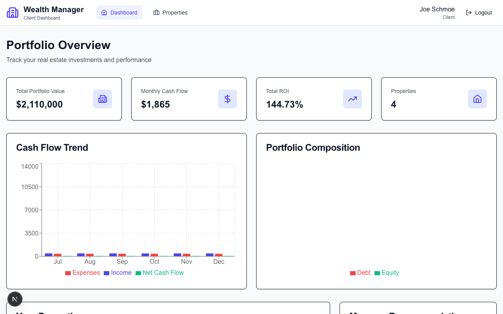

# Property Tax Appeal Automation
## Feature Status & Strategic Roadmap

---

# Executive Summary

**Objective:**  
Automate the analysis and filing of property tax appeals to reduce tax liability for asset owners.

**Current Status:**  
✅ **Proof of Concept Complete:** Full end-to-end UI and backend logic implemented.  
✅ **User Flow:** Seamless wizard guides users from "Analysis" to "Submission".  
✅ **Architecture:** Scalable Next.js + Prisma backend ready for production data.

**Immediate Decision Point:**  
Selecting a data provider for "Comparable Sales" (Comps) to transition from mock data to real-world execution.

---

---

# 1. What We Have Built

**The "Tax Savings Engine"**  
We successfully integrated a tax analysis module into the Asset Dashboard.

*   **Smart Detection:** Automatically flags properties that are over-assessed compared to neighbors.
*   **Interactive Wizard:** A 3-step process for users to:
    1.  Review their assessment.
    2.  Select valid comparable properties (evidence).
    3.  Generate a draft appeal.
*   **Technical Foundation:** Secure API endpoints, database schema for tracking appeals, and robust type safety.

---

# 2. Key Value Proposition

**Why this matters to our users:**

1.  **Direct ROI:** Putting money back in the investor's pocket (Top 3 expense for most owners).
2.  **High Engagement:** Gives users a reason to log in annually.
3.  **Differentiation:** Most asset dashboards track spending; we actively *reduce* it.
4.  **Monetization Potential:** Opportunity for a "Success Fee" model (e.g., % of taxes saved).

---

# 3. Strategic Decision: Data Integration

**The Challenge:**  
Our current proof-of-concept uses **mock data** for "Comparable Properties." To go live, we need a reliable source of real estate data (Sold History, Tax Assessments, SqFt, etc.).

**The Trade-off:**  
Balancing **Capital Efficiency** (Cost) vs. **Data Quality** (Confidence).

---

# 4. Option A: RentCast API (Recommended)

**"The Developer-Friendly Choice"**

*   **Cost:** Free tier (50 calls/mo), then **$74/mo** (scaleable).
*   **Pros:** 
    *   Build specifically for this use case (Rent & Sales comps).
    *   Extremely easy integration.
    *   Predictable monthly pricing.
*   **Cons:** Newer player compared to enterprise giants.

**Verdict:** 🚀 **Best for Launch.** Low risk, quick to implement.

---

# 5. Option B: Estated

**"The Pay-As-You-Go Choice"**

*   **Cost:** **$0.25 per property look-up**.
*   **Pros:** 
    *   No monthly fixed cost (great if volume is low).
    *   Deep property tax data.
*   **Cons:** 
    *   Can get expensive quickly if we scale.
    *   "Comps" logic requires multiple calls (1 call for subject + 5 calls for neighbors = $1.50 per analysis).

**Verdict:** ⚠️ **Good for low volume, but hard to predict costs.**

---

# 6. Option C: Enterprise (Attom / CoreLogic)

**"The Bank-Grade Choice"**

*   **Cost:** **$500 - $1,000+ per month**, annual contracts.
*   **Pros:** 
    *   Gold standard data quality.
    *   Used by major banks and insurers.
*   **Cons:** 
    *   Long sales cycles.
    *   Complex integration.
    *   High upfront burn.

**Verdict:** 🛑 **Avoid for now.** Revisit at Series A or >5k users.

---

# 7. Proposed Roadmap

**Phase 1 (This Week):**  
Select **RentCast** (Free Tier). Update service to replace mock data with real API calls.

**Phase 2 (Next Month):**  
Beta test with 5-10 users. Validate that the "Savings Opportunities" we identify are real and actionable.

**Phase 3 (Post-Funding/Revenue):**  
Evaluate enterprise contracts if data quality from RentCast proves insufficient.

---

# Discussion & Next Steps

1.  **Approval:** Do we have approval to integrate the **RentCast Free Tier**?
2.  **Beta Group:** Who are the first 3 partners/investors we should demo this to?
